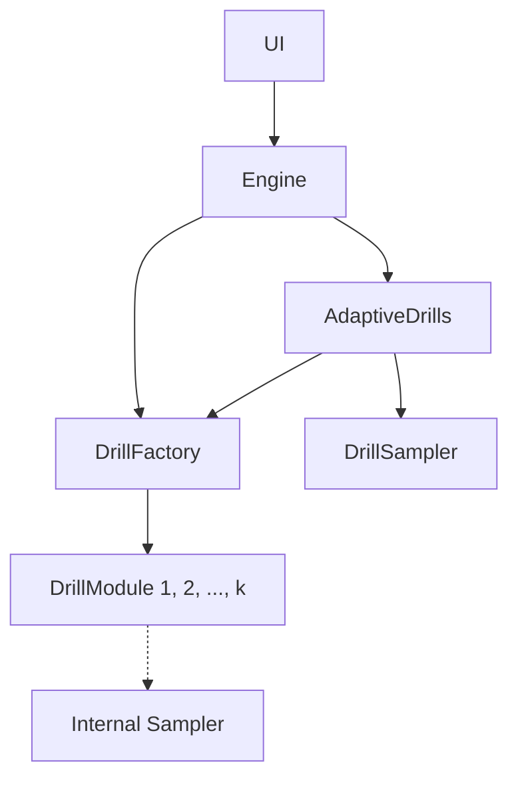

# EarTrainer (Python CLI + Minimal GUI)

EarTrainer is a functional ear‑training toolkit for drilling scale degrees, harmonic intervals, melodic lines, and chords — all in a clear tonal context.

- Chords are voiced realistically: each harmony is served from a small, curated set of three distinct right‑hand voicings (different top notes) plus a bass, to increase variety and reduce overfitting.
- Melodies are sampled with musical bias — small steps favored, consecutive big leaps discouraged — to sound more "line‑like" while still exploring the key space.

Planned features
- Chord progressions: sampled and from a library of common progressions.
- Inversions and extensions: add 1st/2nd inversions, 7ths and beyond.
- Melodic lines with harmony: sampled and song‑inspired accompaniment.
- Non‑diatonic awareness: identify important borrowed/altered chords.
- Chord‑relative pitch ID: identify notes relative to the current chord.
- Natural modulations: key changes that evolve within a session.

This README documents the Python version on the `main` branch. A C++ core is under active development on a separate local branch and not pushed yet (see note at the end).

## Install

Using Conda (recommended):

```
conda create -n eartrainer_py python=3.11 -y
conda activate eartrainer_py
pip install -U pip
pip install -e .
```

Or with venv:

```
python -m venv .venv
source .venv/bin/activate
pip install -U pip
pip install -e .
```

Provide a SoundFont (FluidSynth): see `eartrainer/resources/README.md` for options (GrandPiano.sf2 or GM.sf2) and set `audio.soundfont_path` in `eartrainer/config/defaults.yml` if needed.

## Run (CLI)

List available drills and presets:

```
eartrainer list-drills
eartrainer show-params --drill note --preset default
```

Run a single drill:

```
eartrainer run --config eartrainer/config/defaults.yml \
  --drill note --preset default --questions 40 --key C --scale major
```

Run a sequence (multiple drills back‑to‑back):

```
eartrainer run-sequence --config eartrainer/config/defaults.yml \
  --steps note:40,chord:40 --key Random --scale major
```

Assistance and context (CLI)
- Reference playback (cadence) before the drill.
- Optional drone (sustained I/V) with auto‑duck during questions.
- Replay reference shortcut (press `r` then Enter when prompted if enabled).

## Run (GUI)

```
eartrainer-gui
```

The GUI lets you pick Key, Scale, Drill, question count, and toggle drone. It also supports running predefined “Sets” (see below) from YAML.

## Drills vs. Sets

- A “Drill” is a single training mode (e.g., note, chord, chord_relative, melodic, harmonic_interval). Drills expose presets and parameters via `list-drills` and `show-params`.
- A “Set” is a scripted session composed of multiple steps (drills + counts) defined in YAML under `eartrainer/resources/training_sets/` (e.g., `basic.yml`). The GUI can run these sets directly.

## SoundFonts

See `eartrainer/resources/README.md` for details. In short:
- Place a Grand Piano at `soundfonts/GrandPiano.sf2` or a GM set at `soundfonts/GM.sf2`.
- Update `audio.soundfont_path` in `eartrainer/config/defaults.yml` if you use different names/locations.

## Configuration

- Default config: `eartrainer/config/defaults.yml`
- Training sets: `eartrainer/resources/training_sets/`
- Drone presets (GM): `eartrainer/resources/drones/`

Common tweaks: drill length, allowed degrees, key/scale, drone template/volume, output paths.

## Development

- Dependencies: `pip install -r requirements.txt` (or rely on `pyproject.toml` when installing the package).
- Entry points: `eartrainer` (CLI), `eartrainer-gui` (GUI).

## About the C++ Core (WIP)

A cross‑platform C++ SessionEngine (with Python bindings) is being developed on a separate local branch to support future integrations (e.g., iOS/Android). It is not part of `main` yet and does not affect the Python CLI/GUI.

## C++ Session Engine (eartrainer_Cpp/cpp) – Summary

The C++ session engine provides a deterministic, embeddable core for generating ear‑training sessions. DrillModules now own their internal sampling logic, emitting UI‑ready QuestionBundles with PromptPlans (what to play), while the SessionEngine orchestrates session state, assistance, and summaries. The design is UI‑agnostic (typed JSON payloads), reproducible (seeded RNG), side‑effect free between API calls, and easily bound to Python via pybind11.

- eartrainer/eartrainer_Cpp/cpp/CMakeLists.txt
  - Build config for the static core library, unit test binary, and optional pybind11 module `_earcore`.

- eartrainer/eartrainer_Cpp/cpp/include/ear/types.hpp
  - Core data types: `SessionSpec`, `Note`, `PromptPlan`, `TypedPayload`, `QuestionBundle`, `AssistBundle`, `ResultReport` (+ nested `Metrics`), and `SessionSummary`.

- eartrainer/eartrainer_Cpp/cpp/include/ear/session_engine.hpp
  - Engine interface: `create_session`, `next_question`, `assist`, `submit_result`, `capabilities`; factory `make_engine()` returning a concrete implementation.

- eartrainer/eartrainer_Cpp/cpp/src/session_engine.cpp
  - Implements `SessionEngine` (session lifecycle, eager/adaptive generation, idempotent submit, capability listing). Key helpers: `ensure_factory`, `ensure_question`, `materialise_all`, `build_summary`.

- eartrainer/eartrainer_Cpp/cpp/include/ear/adaptive_drills.hpp
  - `AdaptiveDrills` facade for adaptive bouts. Reads catalog levels (via `adaptive_catalog`) and wraps a collection of drills created by `DrillFactory`; `set_bout(level)` loads drill specs and `.next()` serves a random question.

- eartrainer/eartrainer_Cpp/cpp/include/ear/adaptive_catalog.hpp
  - YAML loader helper that turns `resources/adaptive_levels.yml` into `DrillSpec` lists, keeping file I/O separate from adaptive scheduling.

- eartrainer/eartrainer_Cpp/cpp/src/json_bridge.hpp/.cpp
  - JSON adapters for all public types. Functions: `to_json`/`*_from_json` for `SessionSpec`, `QuestionBundle`, `AssistBundle`, `ResultReport`, `SessionSummary`; includes `PromptPlan` and `TypedPayload` conversions.

- eartrainer/eartrainer_Cpp/cpp/src/bindings.cpp
  - pybind11 module `_earcore` exposing `SessionEngine` to Python (`create_session`, `next_question`, `assist`, `submit_result`, `capabilities`). Includes Python↔JSON conversion utilities.

- eartrainer/eartrainer_Cpp/cpp/src/rng.hpp
  - Simple xorshift RNG utilities: `advance_rng`, `rand_int`, `rand_unit` used for deterministic sampling.

- eartrainer/eartrainer_Cpp/cpp/drills/drill.hpp
  - Abstractions: `DrillModule::configure(SessionSpec)` primes per-session state; `DrillModule::next_question(spec, rng)` returns a `DrillOutput` (typed question, correct answer, optional `PromptPlan`, `ui_hints`).

- eartrainer/eartrainer_Cpp/cpp/drills/common.hpp
  - Music theory helpers and MIDI mapping: `normalize_degree_index`, `degree_to_offset`, `tonic_from_key`, `central_tonic_midi`, range helpers, `midi_candidates_for_degree`, `degree_to_midi`.

- eartrainer/eartrainer_Cpp/cpp/drills/note.hpp/.cpp
  - `NoteDrill` owns the degree/midi sampling with repeat‑avoidance and allowed filters, emitting single-note prompts (`degree` answers, `Replay` assist).

- eartrainer/eartrainer_Cpp/cpp/drills/interval.hpp/.cpp
  - `IntervalDrill` internally selects bottom degree + size (with optional filters), computes MIDI/orientation, and produces two-note prompts (`interval_class` answers, `Replay`/`GuideTone` assists).

- eartrainer/eartrainer_Cpp/cpp/drills/melody.hpp/.cpp
  - `MelodyDrill` maintains the weighted diatonic step model (recent-sequence suppression) and emits count-in multi-note prompts (`melody_notes` answers, `Replay`/`TempoDown` assists).

- eartrainer/eartrainer_Cpp/cpp/drills/chord.hpp/.cpp
  - `ChordDrill` samples degree/quality/voicing internally (including bass offsets) and renders block-chord prompts (`chord_degree` answers, `Replay`/`GuideTone` assists).

- eartrainer/eartrainer_Cpp/cpp/assistance/assistance.hpp/.cpp
  - Assistance generation: returns `AssistBundle` for `Replay`, `GuideTone`, `TempoDown`, `PathwayHint`, optionally altering `PromptPlan` and adding `ui_delta` messages. Main: `assistance::make_assist`.

- eartrainer/eartrainer_Cpp/cpp/scoring/scoring.hpp/.cpp
  - Scoring utilities used for summaries: `score_question`, `aggregate_accuracy`, `average_response_time` with simple latency/assist penalties.

- eartrainer/eartrainer_Cpp/cpp/tests/test_session_engine.cpp
  - Minimal tests: determinism under seeded eager generation, assist/submit idempotence, RNG side‑effect checks, and JSON round‑trip of public types.

Note: The directory `include/nlohmann/json.hpp` contains the vendored JSON library used for all typed JSON payloads.

# System Architecture Overview

## Mermaid Diagram


## Module Responsibilities

### 1. Engine
**Purpose:** Main orchestrator of the C++ core. Interfaces with UI (Python, Android, iOS, etc.) and memory/user data.

**Modes:**
- **Drill mode** – user selects a single drill.
- **Set mode** – user selects a stack of drills.
- **Adaptive mode** – system automatically manages drills and difficulty.

**Key Methods:**
- `engine.create_session(SessionSpec)` – initialize a session.
- `engine.next_question() -> QuestionBundle` – generate next question.
- `engine.submit_result(ResultReport)` – receive feedback from user.
- `engine.end_session() -> MemoryPackage` – finalize session and produce summary.
- `engine.diagnostic() -> EngineStatePackage` – report internal state.

### 2. DrillFactory (DF)
**Purpose:** Unified front-end for interacting with all drills or stacks of drills. Provides a common interface for question generation and result collection.
(To be later renamed DrillHub but currently this name conflit with some old code not needed anymore)

**Key Methods:**
- `df.set_bout([DrillSpec])` – initialize a bout with selected drills.
- `df.next(k) -> QuestionBundle` – fetch next question from drill *k*.
- `df.diagnostics() -> DrillFactoryState` – provide drill hub diagnostics.

### 3. AdaptiveDrills (AD)
**Purpose:** Builds and manages adaptive bouts using user level and performance. Selects drills dynamically from pre-defined levels. Adjusts difficulty on-the-fly and updates user progress.

**Bout Types:**
- **Warm-up** – gentle start with lower difficulty.
- **Standard** – regular adaptive sequence.
- **Mixed** – combine multiple drill types (e.g., melody + chords).
- **Exam** – evaluation bout to graduate to next level.

**Key Methods:**
- `ad.set_bout(level, score)` – set current bout parameters.
- `ad.next() -> QuestionBundle` – request next adaptive question.
- `ad.feedback(ResultReport)` – update internal performance tracking.
- `ad.update_level()` – recompute level/score post-bout.

### 4. DrillModule (DM)
**Purpose:** Encapsulates logic for one specific drill family (e.g., melody, chord, interval). Handles creation of individual questions by delegating to its sampler.

**Key Methods:**
- `dm.configure(SessionSpec)` – configure tempo, key, range, etc.
- `dm.next() -> QuestionBundle` – generate question via internal sampler.
- `dm.feedback(ResultReport)` – collect and process user feedback.

### 5. Sampler (S)
**Purpose:** encapsulates the logic of randomly choosing scale degrees and next note in a melody line, chords etc. These samplers now live entirely inside `DrillModule` implementations and are never exposed externally. 

### 6. DrillSampler (DS)
**Purpose:** The sampler logic specifically used by `AdaptiveDrills` to select which drill (and difficulty variant) to present next. Balances challenge and engagement.

**Sampler Modes:**
- **Uniform:** random among available drills.
- **Progressive:** gradually increases difficulty.
- **Responsive:** adapts immediately based on last few results.
- **Streak:** stays on the same drill for a few questions before changing.

---

### Summary
This architecture separates orchestration (Engine), adaptation (AdaptiveDrills), and generation (DrillHub + DrillFactory). Each drill remains modular, and new families can be added easily by extending `DrillModule`.
