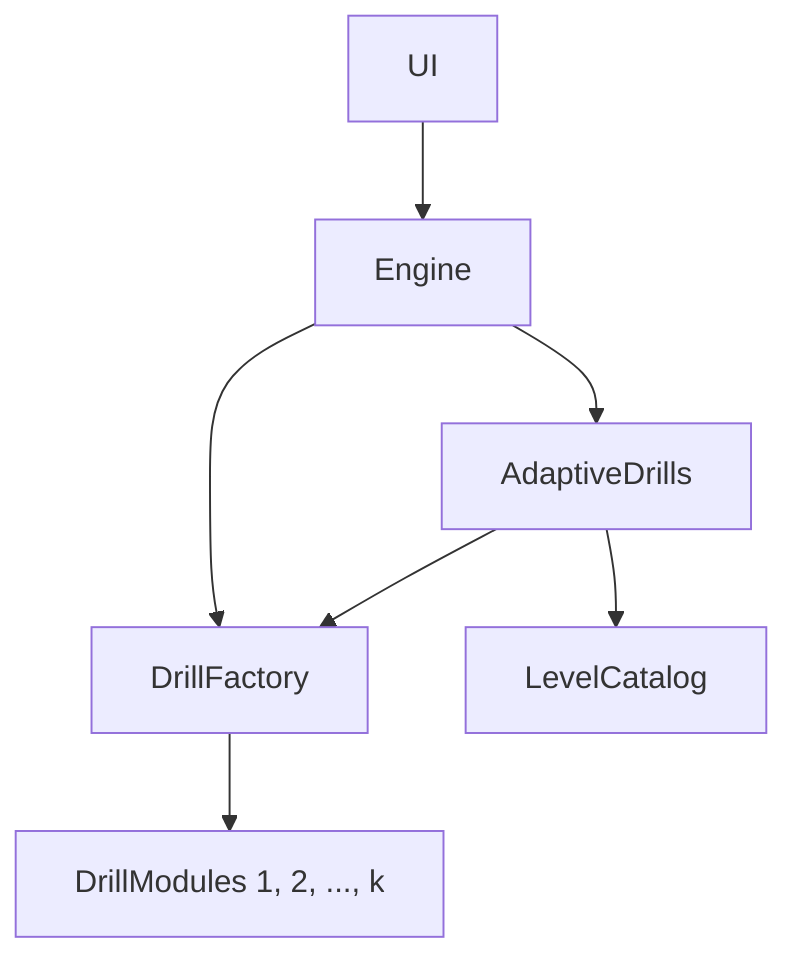

# EarTrainer

EarTrainer pairs a deterministic C++ SessionEngine with lightweight clients so you can drill scale degrees, harmonic intervals, melodic lines, and chords in a consistent tonal context across platforms.

- The Python CLI + minimal GUI (this repo) talk to the engine through pybind, keeping everything scriptable.
- A SwiftUI client (see `Packages/AppUI`) links the same static library for iOS/macOS builds.
- The legacy pure-Python prototype (far fewer drills, no adaptive levels) lives on the `legacy/python_keep` branch for archival reference only.

Musical highlights:
- Chords are voiced from a curated pool (three RH voicings plus bass) to reduce “guess the MIDI pattern” habits.
- Melodies bias toward steps and limit repeated big leaps so prompts feel like lines rather than random jumps.

Planned features
- Chord progressions: sampled and from a library of common progressions.
- Inversions and extensions: add 1st/2nd inversions, 7ths and beyond.
- Melodic lines with harmony: sampled and song‑inspired accompaniment.
- Non‑diatonic awareness: identify important borrowed/altered chords.
- Chord‑relative pitch ID: identify notes relative to the current chord.
- Natural modulations: key changes that evolve within a session.

This README focuses on the Python client; the shared C++ engine + Swift bridge ship from the same tree described here.

## Current Drill Kinds

- **Note** – identify single diatonic degrees with optional pathway/tonic anchor helpers.
- **Melody** – short scalar or skip-biased phrases with configurable tempo and helper tones.
- **Chord** – identify chord degrees from realistically voiced prompts (piano, strings, sustain) with inversion aids.
- **Harmony** – recognize degrees inside harmonic blocks, with helper/no-helper variants.
- **Interval** – melodic & harmonic interval comparisons drawn from configurable sets and render styles.

## Adaptive Mode (preferred)

`AdaptiveDrills` is the “just play” mode: it reads the built-in numbered level catalog (hundreds of melody, harmony, and chord lessons), chooses the next drill for you, and keeps the three tracks moving without any manual setup or external files.

- **Integrated catalog** – every drill lives in the binary manifest; AdaptiveDrills simply walks it and instantiates what you need.
- **Automatic continuity** – the engine tracks your level per family (melody / harmony / chord) and rotates through them so lagging areas get more reps.
- **Comfort-first progression** – accuracy is monitored continuously; as long as you stay in the comfortable zone the bout nudges difficulty upward, and once you sustain higher scores it graduates you to the next level. If performance dips, it backs off until you recover.

Each type of drill has various helpers and simplifications for gradual improvement, as well as more difficult variations. 

## Install

Using Conda (recommended):

```
conda create -n eartrainer_py python=3.11 -y
conda activate eartrainer_py
pip install -U pip
pip install -e .
```

Or with venv:

```
python -m venv .venv
source .venv/bin/activate
pip install -U pip
pip install -e .
```

Provide a SoundFont (FluidSynth): see `eartrainer/resources/README.md` for options (GrandPiano.sf2 or GM.sf2) and set `audio.soundfont_path` in `eartrainer/config/defaults.yml` if needed.

## Run (CLI)

List available drills and presets:

```
eartrainer list-drills
eartrainer show-params --drill note --preset default
```

Run a single drill:

```
eartrainer run --config eartrainer/config/defaults.yml \
  --drill note --preset default --questions 40 --key C --scale major
```

Run a sequence (multiple drills back‑to‑back):

```
eartrainer run-sequence --config eartrainer/config/defaults.yml \
  --steps note:40,chord:40 --key Random --scale major
```

Assistance and context (CLI)
- Reference playback (cadence) before the drill.
- Optional drone (sustained I/V) with auto‑duck during questions.
- Replay reference shortcut (press `r` then Enter when prompted if enabled).

## Run (GUI)

```
eartrainer-gui
```

The GUI lets you pick Key, Scale, Drill, question count, and toggle drone. It also supports running predefined “Sets” (see below) from YAML.

## Drills vs. Sets

- A “Drill” is a single training mode (e.g., note, chord, chord_relative, melodic, harmonic_interval). Drills expose presets and parameters via `list-drills` and `show-params`.
- A “Set” is a scripted session composed of multiple steps (drills + counts) defined in YAML under `eartrainer/resources/training_sets/` (e.g., `basic.yml`). The GUI can run these sets directly.

## SoundFonts

See `eartrainer/resources/README.md` for details. In short:
- Place a Grand Piano at `soundfonts/GrandPiano.sf2` or a GM set at `soundfonts/GM.sf2`.
- Update `audio.soundfont_path` in `eartrainer/config/defaults.yml` if you use different names/locations.

## Configuration

- Default config: `eartrainer/config/defaults.yml`
- Training sets: `eartrainer/resources/training_sets/`
- Drone presets (GM): `eartrainer/resources/drones/`

Common tweaks: drill length, allowed degrees, key/scale, drone template/volume, output paths.

## Development

- Dependencies: `pip install -r requirements.txt` (or rely on `pyproject.toml` when installing the package).
- Entry points: `eartrainer` (CLI), `eartrainer-gui` (GUI).

## Clients

- **Python CLI / GUI** (`eartrainer`, `eartrainer-gui`) – install via the steps above; powered by the `_earcore` pybind module.
- **SwiftUI app** (`Packages/AppUI`) – links `EarTrainerEngine` for iOS/macOS with the same catalog resources.
- **Legacy Python** (`legacy/python_keep` branch) – the original, feature-light prototype; kept for historical reference only.

# System Architecture Overview



## SessionEngine API

- `create_session(spec) -> session_id`
- `next_question(session_id) -> QuestionBundle | SessionSummary`
- `assist_options(session_id) -> [string]`
- `assist(session_id, kind) -> AssistBundle`
- `submit_result(session_id, report) -> QuestionBundle | SessionSummary`
- `end_session(session_id) -> MemoryPackage`
- `session_key(session_id) -> string`
- `orientation_prompt(session_id) -> MidiClip`
- `debug_state(session_id) -> json`
- `capabilities() -> json`
- `drill_param_spec() -> json`
- `adaptive_diagnostics(session_id) -> json`
- `set_level(session_id, level, tier)`
- `level_catalog_overview(session_id) -> string`
- `level_catalog_levels(session_id) -> string`
- `level_catalog_entries(spec) -> [LevelCatalogEntry]`
