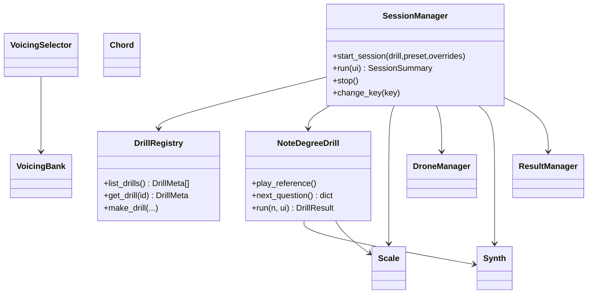

# Architecture

```mermaid
classDiagram
  class SessionManager {
    +start_session(drill,preset,overrides)
    +run(ui) SessionSummary
    +stop()
    +change_key(key)
  }
  class DrillRegistry {
    +list_drills() DrillMeta[]
    +get_drill(id) DrillMeta
    +make_drill(...)
  }
  class NoteDegreeDrill {
    +play_reference()
    +next_question() dict
    +run(n, ui) DrillResult
  }
  class Scale
  class Chord
  class VoicingSelector
  class VoicingBank
  class DroneManager
  class Synth
  class ResultManager

  SessionManager --> DrillRegistry
  SessionManager --> NoteDegreeDrill
  SessionManager --> Scale
  SessionManager --> DroneManager
  SessionManager --> Synth
  SessionManager --> ResultManager
  NoteDegreeDrill --> Synth
  NoteDegreeDrill --> Scale
  VoicingSelector --> VoicingBank
```

- Services are constructed once per session (Synth, Drone).
- Drills encapsulate music logic and grading; SessionManager handles orchestration.
