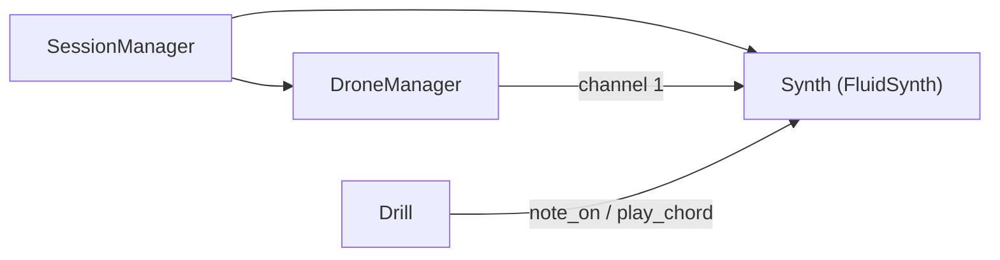

# Audio: Synth and Drone

```mermaid
flowchart LR
  SM[SessionManager] --> S["Synth (FluidSynth)"]
  SM --> D[DroneManager]
  D -->|channel 1| S
  Drill[Drill] -->|note_on / play_chord| S
```

- `Synth`: channel 0 piano; per‑channel program/CC APIs.
- `DroneManager`: sustained strings on channel 1; fade in/out; inactivity timeout; auto‑restart on activity.
