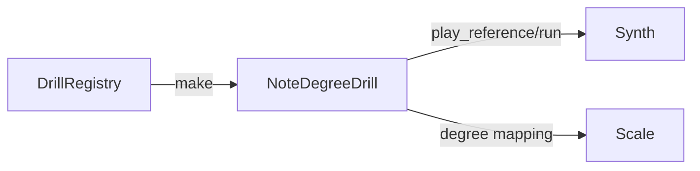

# Drills and Registry

```mermaid
flowchart LR
  DR[DrillRegistry] -->|make| Note[NoteDegreeDrill]
  Note -->|play_reference/run| Synth
  Note -->|degree mapping| Scale
```

- `DrillRegistry`: lists drills and presets; builds drill instances.
- `NoteDegreeDrill`: plays a random diatonic degree; shuffle‑bag avoids immediate repeats.
