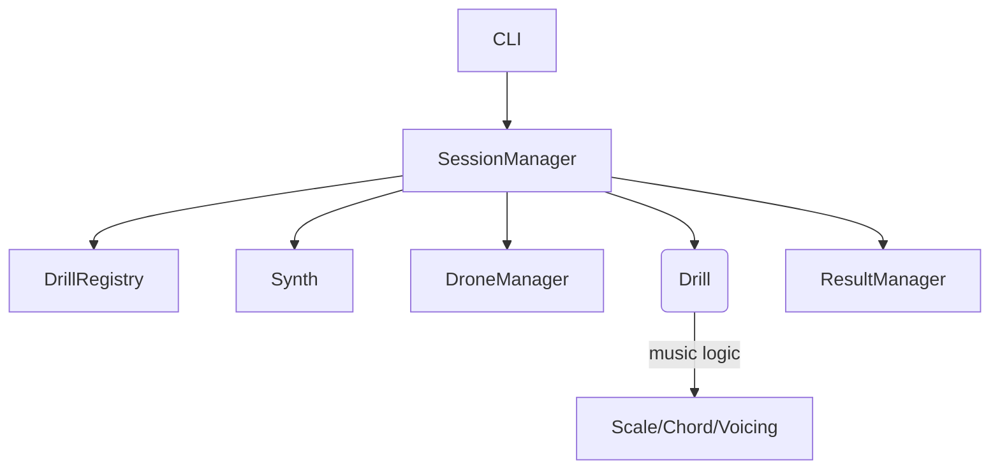

# EarTrainer — Overview

Short, high‑level map of the current system.

- CLI: entrypoint `eartrainer` (run/list/show-params)
- SessionManager: orchestrates session, builds services, runs drill
- DrillRegistry: discovers drills and presets
- Drill: current NoteDegreeDrill (single‑note degree ID)
- Theory: Scale, Chord, VoicingBank/Selector for cadence
- Audio: FluidSynth Synth + DroneManager
- Results: scaffolded manager (in‑memory for now)
