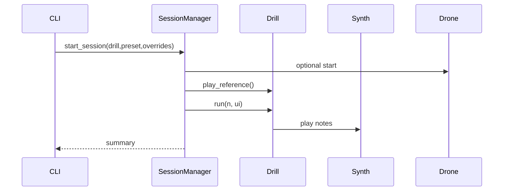

# Session & Results

```mermaid
sequenceDiagram
  participant CLI
  participant SM as SessionManager
  participant Drill
  participant Synth
  participant Drone
  CLI->>SM: start_session(drill,preset,overrides)
  SM->>Drone: optional start
  SM->>Drill: play_reference()
  SM->>Drill: run(n, ui)
  Drill->>Synth: play notes
  SM-->>CLI: summary
```

- `SessionManager`: single source of truth for params and runtime.
- `ResultManager`: scaffold ready for persistence and summaries.
