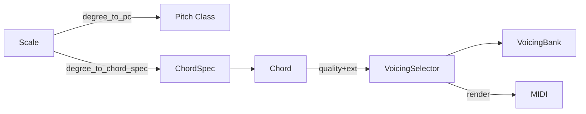

# Theory: Scale, Chord, Voicing

- `Scale`: degree mapping and `ChordSpec` creation.
- `Chord`: concrete chord (root, quality, extensions).
- `VoicingBank`: template catalog (right hand, bass; tags).
- `VoicingSelector`: chooses a template and renders to MIDI with register policy and clamping.
