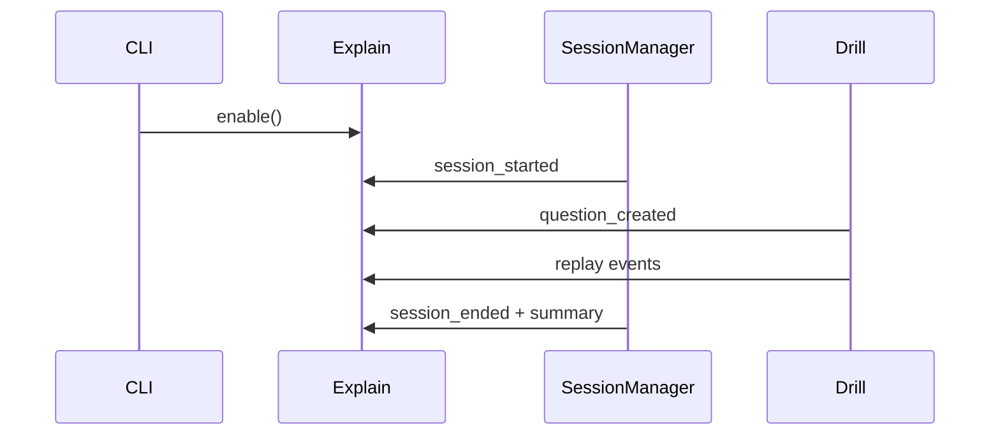

# Tracing (Explain Mode)

- Toggle via CLI `--explain`.
- Emits short trace lines at key milestones (session start/end, question created, replay, graded, summary).

```mermaid
sequenceDiagram
  participant CLI
  participant Explain
  participant SM as SessionManager
  participant Drill
  CLI->>Explain: enable()
  SM->>Explain: session_started
  Drill->>Explain: question_created
  Drill->>Explain: replay events
  SM->>Explain: session_ended + summary
```
